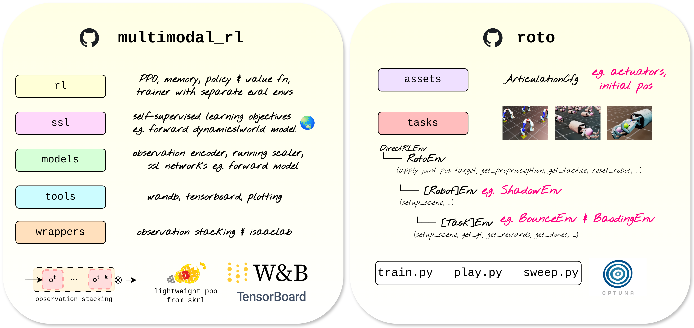

# Rigorous RL (`rigorous_rl`)

`rigorous_rl` provides a streamlined and robust foundation for training robotic agents in Isaac Lab with PPO. It is designed to be used as a core dependency for your experiments, allowing you to focus on environment design while the library handles the RL "heavy lifting." This library works in tandem with `roto`, which provides ready-to-use example environments and optimised agents.

## ✨ Features
- **Multimodal perception**: Designed to handle flexible dictionary observations (RGB, Depth, Proprioception, Tactile, and Ground-truth states) with integrated Self-Supervised Learning (SSL) for enhanced representation learning (e.g. learning world models 🌏).
- **Observation stacking**: Uses `LazyFrame` stacking to handle partially observable environments, essential for real-world robotics.
- **Transparent codebase**: Most RL libraries sacrifice clarity for modularity. We condense the entire PPO logic into four readable files, making it easy to inspect "under-the-hood".
- **Robust research**: Integrated hyperparameter optimisation with Optuna to ensure fair comparisons and well-tuned agents.
- **Evaluation rigor**: Dedicated split for training and evaluation parallelised environments to ensure efficient and accurate performance reporting.


## Installation

1. Install Isaac Lab via pip with [these instructions](https://isaac-sim.github.io/IsaacLab/main/source/setup/installation/isaaclab_pip_installation.html)

2. Install `rigorous_rl` as a local editable package.

```
git clone git@github.com:elle-miller/rigorous_rl.git
cd rigorous_rl
pip install -e .
```
You should now see it with `pip show rigorous_rl`.

3. Setup your own project! Check out [roto](https://github.com/elle-miller/roto) to use existing environments or as a template for your own.

## 🔬 Motivation: Why "Rigorous" RL?
Are you a researcher wanting to get into Reinforcement Learning with Isaac Lab as painlessly as possible? Rigorous RL is for you!

In modern robotics research, RL implementations are often optimised for "demos" rather than science. This leads to several pain points that Rigorous RL solves:

- **Code Transparency:** Most RL libraries sacrifice clarity for modularity, spreading a single algorithm's logic across dozens of files. This makes it difficult to inspect "under-the-hood". We condense our core logic into 4  files, so you know exactly what your gradients are doing.

- **Scientific Reporting:** In many robotics papers, standard RL norms - like separating evaluation returns from training returns and reporting returns across fixed seeds - are overlooked. Rigorous RL enforces these standards by default, ensuring your results are robust.

- **Hyperparameter Integrity:** RL agent performance is a product of tuning, not just algorithms. We provide integrated Hyperparameter Optimization (HPO) tools to ensure your agents are well-tuned and your comparisons are fair.

- **Multimodal Perception:** Robotics is rarely just about state vectors. Our framework is designed from the ground up to handle multimodal observations (RGB, depth, proprioception, tactile) with self-supervision for enhanced representation learning and observation stacking to tackle partially observable environments.

If you are new to RL, this library removes the "re-implementation tax" and lets you focus on the science.

## 🏗 How it Works
`rigorous_rl` contains the RL engine, while your project repo contains the environments/research/science. This separation allows you to pull updates from the core library without messy merge conflicts in your environment code.

`rigorous_rl` provides 5 core functionalities:

1. **rl**: Clean PPO implementation
2. **ssl**: Modules for self-supervision learning
2. **models**: Standardised backbones (MLPs, CNNs) and running scalers.
3. **tools**: Scripts to produce nice RL paper plots, and extra stuff like latent trajectory visualisation.
4. **wrappers**: Wrappers for observation stacking and Isaac Lab

## 📜 Credits
The PPO implementation is a streamlined and modified version of [SKRL](https://github.com/Toni-SM/skrl). Full credits to toni-sm for the initial foundation. This local version has been refactored to accomodate the aforementioned changes.


## 📚 Citation
If this framework helps your research, please cite:
```
@misc{miller2026_rigorous_rl,
  author       = {Elle Miller},
  title        = {rigorous_rl: High-Integrity RL for Isaac Lab},
  year         = {2026},
  howpublished = {\url{https://github.com/elle-miller/rigorous_rl}},
  note         = {GitHub repository}
}
```
 
