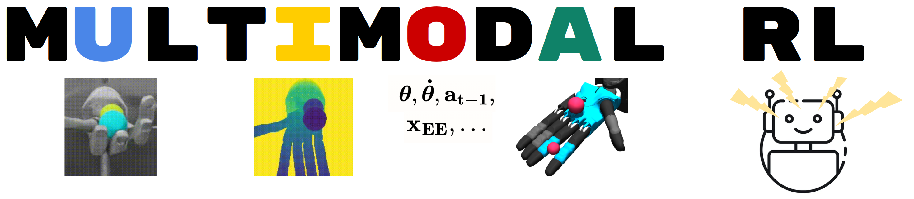
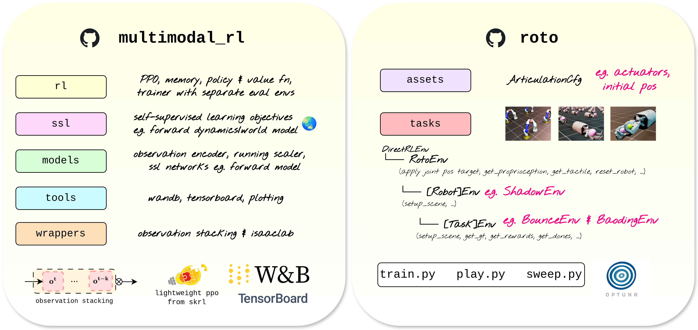

<!-- # Multimodal RL (`multimodal_rl`) -->


Real-world robotics must move beyond simple state vectors. `multimodal_rl` provides a streamlined and robust foundation for training robotic agents in Isaac Lab that perceive the world through multiple lenses.

This library is designed as a core research dependency. It handles the RL "heavy lifting" and multimodal fusion, allowing you to focus on your environment and task science. It works in tandem with [roto](https://github.com/elle-miller/roto), which provides ready-to-use example environments and optimised agents.

## ✨ Features
- **Multimodal perception**: Native support for flexible dictionary observations (RGB, Depth, Proprioception, Tactile, and Ground-truth states).
- **Self-supervised learning**: Built-in integration for SSL auxiliary tasks (reconstruction, world models 🌏) to accelerate representation learning from multimodal observations.
- **Observation stacking**: Uses `LazyFrame` stacking to handle partially observable environments, essential for real-world robotics.
- **Transparent codebase**: Most RL libraries sacrifice clarity for modularity. We condense the entire PPO logic into four readable files, making it easy to inspect "under-the-hood".
- **Robust research**: Integrated hyperparameter optimisation with Optuna to ensure fair comparisons and well-tuned agents.
- **Evaluation rigor**: Dedicated split for training and evaluation parallelised environments to ensure efficient and accurate performance reporting. Evaluation uses frozen policy snapshots taken at episode boundaries, ensuring consistent metrics throughout each evaluation episode even as the networks update throughout training. 


## Installation

1. Install Isaac Lab via pip with [these instructions](https://isaac-sim.github.io/IsaacLab/main/source/setup/installation/isaaclab_pip_installation.html)

2. Install `multimodal_rl` as a local editable package.

```
git clone git@github.com:elle-miller/multimodal_rl.git
cd multimodal_rl
pip install -e .
```
You should now see it with `pip show multimodal_rl`.

3. Setup your own project! Check out [roto](https://github.com/elle-miller/roto) to use existing environments or as a template for your own.


## 🏗 How it Works
`multimodal_rl` contains the RL engine, while your project repo contains the environments/research/science. This separation allows you to pull updates from the core library without messy merge conflicts in your environment code.

`multimodal_rl` provides 5 core functionalities:

1. **rl**: Clean PPO implementation
2. **ssl**: Modules for self-supervision learning
2. **models**: Standardised backbones (MLPs, CNNs) and running scalers.
3. **tools**: Scripts to produce nice RL paper plots, and extra stuff like latent trajectory visualisation.
4. **wrappers**: Wrappers for observation stacking and Isaac Lab




### Agent configuration
An agent is defined by its `{cfg_name}.yaml` file, which specifies the `agent`, `observations`, `encoder`, `policy`, `value`, `trainer`, `experiment` setup. The `agent` defines the PPO hyperparameters, largely similar to `skrl` setup. There are important differences in our PPO implementation, read more here.

We use dictionary-style observations, and categorising into proprioception, tactile, rgb, depth, and gt (ground-truth). To specify which observations are used, add the keys to `obs_list` in the agent cfg.

```
observations:
  obs_list:
  - prop
  - tactile
  - rgb
  - depth
  - gt
  obs_stack: 4
  pixel_cfg: 
    width: 80
    height: 80
    latent_pixel_dim: 256
    normalise_rgb: false
    max_depth: 2.0
  tactile_cfg:
    binary_tactile: true
    binary_threshold: 0.01

encoder:
  method: "early"
  hiddens: [1024, 512, 256]
  activations: ["elu", "elu", "elu"]
  layernorm: True
  state_preprocessor: True
  latent_state_dim: 256

policy:
  state_dependent_log_std: True
  clip_log_std: True
  initial_log_std: 0
  min_log_std: -20.0
  max_log_std: 2.0
  hiddens: [128, 64]
  activations: ["elu", "elu", "tanh"]
  
value:
  hiddens: [128, 64]
  activations: ["elu", "elu", "identity"]
```

### Evaluation Procedure
Evaluation runs continuously in parallel with training using dedicated evaluation environments. At each episode boundary (every `max_episode_length` steps), the current policy and encoder are snapshotted into frozen copies. These frozen models are used exclusively for evaluation, ensuring that each evaluation episode uses a consistent policy version even as training continues and updates the live policy. Evaluation environments are visually distinguished in the simulation (typically marked with pink boxes) and reset synchronously at episode boundaries. Episode metrics (returns, info logs) are accumulated with proper masking for terminated/truncated episodes, and logged at episode boundaries.

### Staggered Resets 

Training environments use staggered resets by default, where each environment starts with a random initial episode length offset uniformly distributed across `[0, max_episode_length)`. This prevents all training environments from resetting simultaneously, improving sample diversity and training stability by ensuring environments are at different stages of their episodes throughout training.


## 📜 Credits
The PPO implementation is a streamlined and modified version of [SKRL](https://github.com/Toni-SM/skrl). This version has been refactored to prioritise multimodal fusion, evaluation rigor, and transparency.


## 📚 Citation
If this framework helps your research, please cite:
```
@misc{miller2026_multimodal_rl,
  author       = {Elle Miller},
  title        = {multimodal_rl: Multimodal RL for Real-world Robotics},
  year         = {2026},
  howpublished = {\url{https://github.com/elle-miller/multimodal_rl}},
  note         = {GitHub repository}
}
```
 
